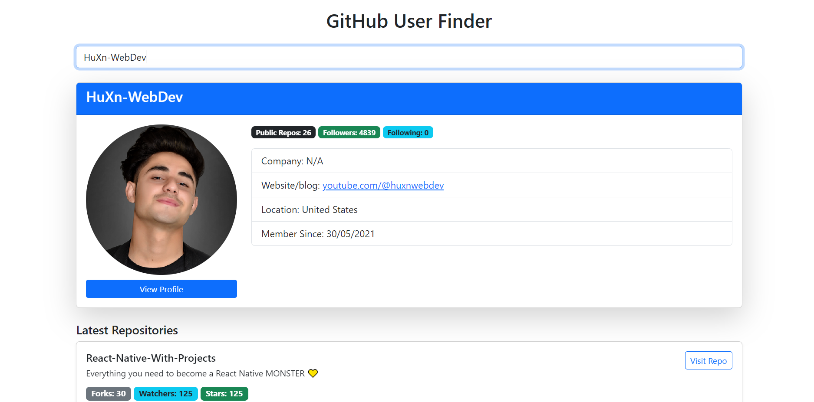

# 🔍 GitHub Profile Viewer

A web application that allows users to search for any GitHub username and view their profile information, latest repositories using the GitHub REST API.


## 📸 Preview



---

## 🚀 Features

- 🔎 Search for GitHub users by username
- 👤 View detailed user profile information:
  - Avatar, name, location, blog, company
  - Public repo count, followers, following
  - Account creation date
- 🆕 View **latest 5 repositories**
- 💡 Clean, responsive UI with Bootstrap
- 🌐 Uses GitHub REST API with personal token for enhanced rate limits

---

## 🧰 Tech Stack

- **Frontend**: HTML, CSS, Bootstrap, jQuery
- **Backend**: Node.js, Express.js
- **API**: GitHub REST API v3
- **Environment Variables**: `dotenv` for token management

---

## 📦 Installation & Setup

1. **Clone the repository**

```bash
git clone https://github.com/GitAbdalla/GithubFinder.git

